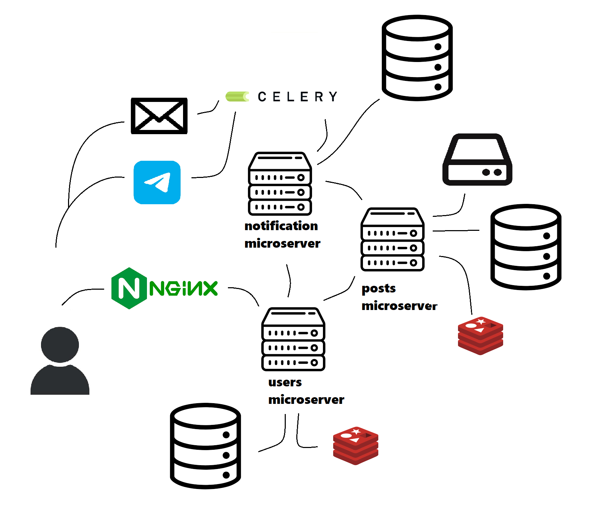

# Приложение POSTEBIN

# Архитектура Проекта



Это приложение разделено на три микросервиса, что позволяет мне не только освоить передовые практики микросервисной архитектуры, но и эффективно распределять ресурсы. Каждый микросервис отвечает за отдельный функционал, обеспечивая высокую гибкость и масштабируемость системы.

## 1. Микросервис авторизации и регистрации

 Первый микросервис обеспечивает авторизацию и регистрацию пользователей. Для хранения данных о пользователях мы используем PostgreSQL, который служит надежным хранилищем информации. Этот микросервис отвечает за управление учетными записями, проверку учетных данных и обеспечение безопасности пользовательской информации.

## 2. Микросервис управления постами

Второй микросервис отвечает за создание, изменение и отображение постов. Логика создания постов включает несколько этапов:
1. Текстовый файл сохраняется на удаленном сервере (на этапе разработки файл сохраняется на локальном диске).
2. Генерируется уникальный URL для поста в формате `username/title`.
3. Информация о посте сохраняется в базе данных.

Когда пользователь просматривает пост, в базе данных выполняется следующий запрос:
```sql
SELECT * FROM posts 
WHERE url = 'Переданный клиентом url'
```

На основании полученных данных формируется и отображается контент поста.

## 3. Микросервис уведомлений

Третий микросервис отвечает за отправку уведомлений о событиях, а также за отправку одноразовых кодов для сброса пароля. Этот микросервис обеспечивает оперативное информирование пользователей и поддерживает их безопасность, предоставляя необходимые инструменты для восстановления доступа к учетным записям.

Для управления отправкой уведомлений используется планировщик задач Celery. Это позволяет эффективно обрабатывать асинхронные задачи, такие как рассылка уведомлений или выполнение других фоновых операций.

# Подготовка сервера 

## Создание контейнера

Создайте файл с именем <span style="color:red;">docker-compose.yaml</span>

Со следующим содержанием:

```yaml
version: '3.5'

services:
  db_users:
    container_name: db_users
    ports:
      - "5432:5432"
    environment:
      - POSTGRES_PASSWORD=root
      - POSTGRES_USER=admin
      - POSTGRES_DB=POSTGRES
    image: postgres:14.3-alpine
  redis_posts:
    container_name: redis_posts
    ports:
      - "6379:6379"
    image: redis:7.2
```

## Установка git

```
sudo apt-get update
sudo apt-get install git
```

## Установка docker 
```
sudo apt-get update
sudo apt-get install ca-certificates curl gnupg
sudo install -m 0755 -d /etc/apt/keyrings
curl -fsSL https://download.docker.com/linux/ubuntu/gpg | sudo gpg --dearmor -o /etc/apt/keyrings/docker.gpg
sudo chmod a+r /etc/apt/keyrings/docker.gpg

echo \
  "deb [arch=$(dpkg --print-architecture) signed-by=/etc/apt/keyrings/docker.gpg] https://download.docker.com/linux/ubuntu \
  $(. /etc/os-release && echo "$VERSION_CODENAME") stable" | \
  sudo tee /etc/apt/sources.list.d/docker.list > /dev/null
sudo apt-get update

sudo apt-get install docker-ce docker-ce-cli containerd.io docker-buildx-plugin docker-compose-plugin
```

## Установка docker-compose

```
apt indyall docker-compose
```

## Запуск 

```
docker-compose up --build
``` 

## Остановка контейнера

```
docker-compose down
```

Эта команда остановит и удалит все контейнеры. Она также удалит сети, которые были созданы для ваших контейнеров, и освободит ресурсы, занятые контейнерами.

Если вы хотите остановить контейнеры без их удаления, вы можете использовать команду

```
docker-compose stop
```
Эти контейнеры остановятся, но останутся в системе. Запустить их заново можно командой

```
docker-compose start
```

## Пример подключения к PostgreSQL через Python

```python
import psycopg2

try:
    connection = psycopg2.connect(
        host='0.0.0.0',
        user='admin',
        password='root',
        database='postgres'
    )

    connection.autocommit=True

    with connection.cursor() as cursor:
        cursor.execute(
            """SELECT VERSION()"""
        )
        for i in cursor.fetchall():
            print(i)

    connection.close()
except Exception as e:
    print(e)
```
## Пример подключения к Redis через Python

```python
import redis, json

try:
  redis_client = redis.StrictRedis(
      host='localhost',  
      port=6379,         
      db=0,              
      decode_responses=True  
  )
except Exception as e:
  print(f'Произошла ошибка подключения {e}') 

key = 'example_key'
value = {'user_id': 1, 'name': 'Alice', 'email': 'alice@example.com'}
redis_client.setex(key, 180, json.dumps(value))

cached_value = redis_client.get(key)
if cached_value:
    data = json.loads(cached_value)
    print("Данные из Redis:", data)
else:
    print("Ключ не найден в Redis")

```

# Структура базы данных

### Users microservice
#### Users table

| Name          |  Type     | 
|---------------|-----------|
| id            | INTEGER   | 
| uername       | VARCHAR   | 
| useremail     | VARCHAR   | 
| password      | TEXT      | 
| status        | VARCHAR   | 
| register date | TIMESTAMP | 

### Posts microservice
#### Posts table

| Name           | Type      | 
|----------------|-----------|
| id             | INTEGER   |
| title          | VARCHAR   |
| content source | VARCHAR   |
| url            | VARCHAR   |
| create date    | TIMESTAMP |
| created by     | INTEGER   |

### Notification microservice
#### Subscribers table
| Name          | Type    |
|---------------|---------|
| id            | INTEGER |
| follower      | INTEGER |
| followed      | INTEGER |
| notificatiion | BOOLEAN |

#### Telegram table

| Name   | Type    |
|--------|---------|
| userid | INTEGER |
| usertg | INTEGER |